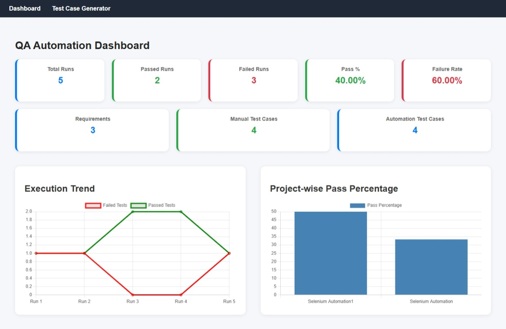
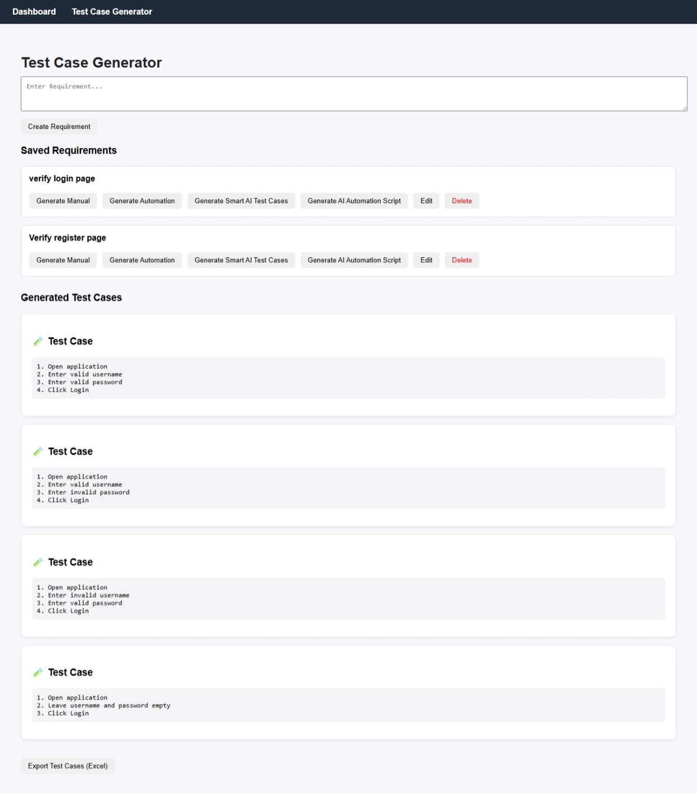
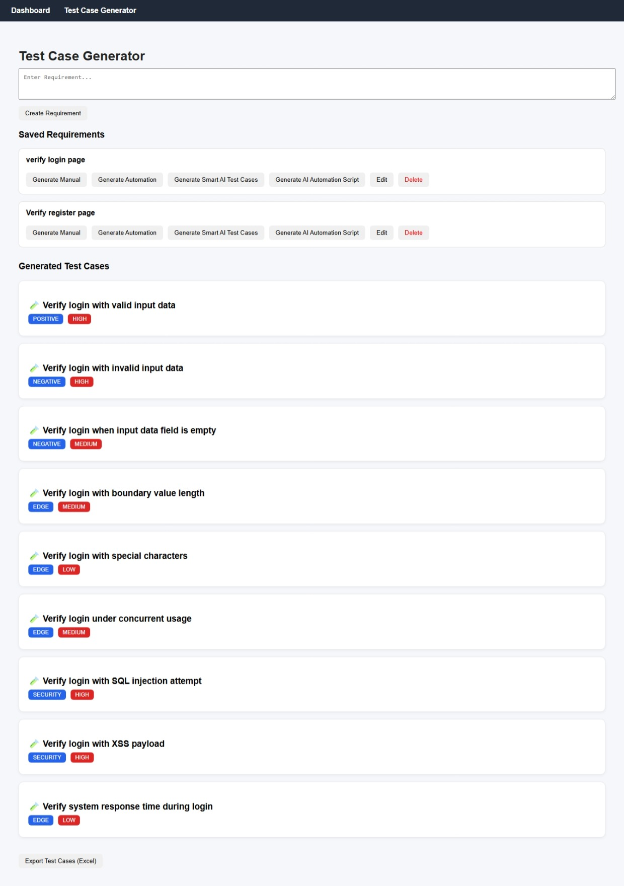
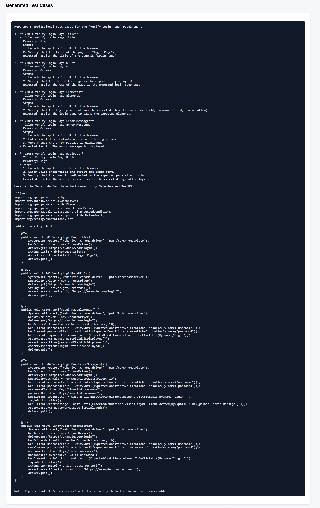

🤖 AI-Powered QA Automation Dashboard

📌 Overview

The **AI-Powered QA Automation Dashboard** is an end-to-end platform that centralizes automation test execution results, CI pipeline data, and AI-assisted test generation into a single dashboard.

It eliminates the need to manually inspect Jenkins logs or raw test reports while also helping QA engineers generate **manual test cases, automation scripts, and AI-generated test scenarios**.

This platform combines **automation analytics + AI-driven QA assistance** to improve testing efficiency and visibility.

---

🎯 Problem Statement

In many QA projects:

* Automation results are scattered across Jenkins logs and reports
* QA leads lack a centralized view of test health
* Identifying trends and recurring failures is time-consuming
* Writing manual test cases and automation scripts is repetitive

This project solves these problems by:

* Centralizing automation execution analytics
* Persisting execution data in a database
* Visualizing automation health metrics
* Generating manual test cases automatically
* Generating automation scripts using AI

---
## 📂 Project Structure

qa-automation-dashboard/
├── backend/ (Spring Boot APIs)
├── frontend/ (React UI)
├── screenshots/ (Application images)
├── README.md

----
🏗️ System Architecture

```
Selenium + TestNG
        ↓
Jenkins CI
        ↓
Spring Boot Backend
        ↓
PostgreSQL Database
        ↓
React Dashboard
        ↓
AI Test Generator (Groq LLM)

```
# 📸 Application Screenshots

## Dashboard



---

## Test Case Generator



---

## AI Generated Test Cases



---

## AI Automation Script Generator


---

🚀 Version 1 – Smart Test Automation Dashboard

Features

Automation Execution Ingestion

* Accepts test execution data via REST APIs
* Supports TestNG XML report parsing (`testng-results.xml`)
* Automatically determines PASS / FAIL status

Jenkins CI Integration

* Jenkins job runs automation tests
* Sends execution results to backend APIs
* Dashboard updates automatically after each CI run

Automation Analytics

* Total execution runs
* Passed runs
* Failed runs
* Pass percentage
* Failure rate
* Execution trend chart
* Project-wise pass percentage

Frontend Dashboard

* Summary analytics cards
* Trend visualization charts
* Project-level analytics
* Clean responsive UI

---

🚀 Version 2 – Test Case Generator

This module allows QA engineers to generate **manual and automation test cases from requirements**.

Features

* Requirement management (Create / Edit / Delete)
* Automatic manual test case generation
* Automation skeleton code generation
* Test case export to Excel
* Requirement-based test case organization

---

🚀 Version 3 – AI QA Copilot

This version integrates **Large Language Models (LLM)** to generate intelligent QA artifacts.

AI Capabilities

AI Test Case Generator

Generates test cases from requirements using AI.

🔄 Workflow

1. Automation tests run in Jenkins
2. Test results are sent to the Spring Boot backend
3. Backend processes and stores execution data
4. React dashboard displays analytics
5. AI modules generate test cases and automation scripts


Example output:

```
Test Case: Verify login with valid credentials
Category: Positive
Priority: High
```

AI Automation Script Generator

Generates Selenium + TestNG automation scripts automatically.

Example output:

```java
@Test
public void verifyLoginValidUser(){

driver.get("loginPage");

driver.findElement(By.id("username")).sendKeys("user");

driver.findElement(By.id("password")).sendKeys("password");

driver.findElement(By.id("loginButton")).click();

Assert.assertTrue(driver.getTitle().contains("Dashboard"));

}
```

---

🧰 Tech Stack

Automation & CI

* Selenium
* TestNG
* Jenkins
* Maven

Backend

* Java
* Spring Boot
* Spring Data JPA
* PostgreSQL
* REST APIs

Frontend

* React
* Axios
* Chart.js

AI Integration

* Groq API
* Llama 3 LLM

---

 ✨ Key Features

- 📊 Automation analytics dashboard (pass/fail trends, execution       metrics)
- 🤖 AI-powered test case generation
- 🧪 Manual test case generator
- ⚙️ AI automation script generator (Selenium + TestNG)
- 📁 Export test cases to Excel
- 🔗 Jenkins CI integration
- 🗄️ PostgreSQL data persistence

---

⚙️ Local Setup Instructions

1️⃣ Clone the repository

```
git clone https://github.com/YOUR_USERNAME/qa-automation-dashboard.git
```

---

2️⃣ Database Setup

Create database in PostgreSQL:

```
CREATE DATABASE qa_dashboard;
```

Update `application.properties`:

```
spring.datasource.url=jdbc:postgresql://localhost:5432/qa_dashboard
spring.datasource.username=postgres
spring.datasource.password=postgres
```

---

3️⃣ Run Backend

```
mvn spring-boot:run
```

Backend runs on:

```
http://localhost:8080
```

---

4️⃣ Run Frontend

```
npm install
npm run dev
```

Frontend runs on:

```
http://localhost:5173
```

---

📈 Example Dashboard Metrics

The dashboard displays:

* Automation pass rate
* Failure analytics
* Execution trends
* Project-wise test health
* Test case generation metrics

---

🔮 Future Improvements

* Role-based authentication
* Cloud deployment
* Advanced AI test generation
* Automated defect prediction
* Test coverage heatmaps

---

👨‍💻 Author

PRAMOD N

QA Engineer | Automation | CI/CD | AI-assisted Testing
